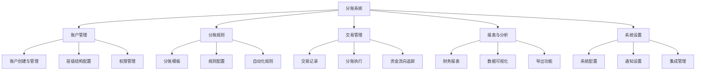

# 分账系统产品需求文档 (PRD)

## 1. 文档信息
### 1.1 版本历史
| 版本号 | 日期 | 修改人 | 修改内容 |
|--------|------|--------|----------|
| v0.1   | 初稿 | 产品经理 | 初始文档创建 |

### 1.2 文档目的
本文档旨在详细描述分账系统的产品需求，为设计、开发和测试团队提供明确的指导和参考。

### 1.3 相关文档引用
- 产品路线图：`docs/Roadmap.md`
- 用户故事地图：`docs/User_Story_Map.md`
- 产品评估指标框架：`docs/Metrics_Framework.md`

## 2. 产品概述
### 2.1 产品名称与定位
**产品名称**：智能分账系统（暂定）

**产品定位**：一个支持多层级账户管理的智能分账平台，帮助用户高效管理资金分配、追踪资金流向，并提供清晰的财务可视化。

### 2.2 产品愿景与使命
**愿景**：成为最值得信赖的智能分账解决方案，让资金管理变得简单透明。

**使命**：通过技术创新简化复杂的分账流程，提高资金管理效率，为用户创造价值。

### 2.3 价值主张与独特卖点(USP)
- 多层级账户结构，满足复杂组织架构需求
- 灵活的分账规则配置，适应不同业务场景
- 实时资金流向追踪，提高资金透明度
- 智能报表与分析，辅助决策

### 2.4 目标平台列表
- Web平台（响应式设计，支持PC和移动端浏览器）

### 2.5 产品核心假设
1. 用户需要一个能够处理复杂分账关系的系统
2. 现有解决方案在多层级分账管理方面存在不足
3. 用户愿意为提高资金管理效率和透明度付费
4. 安全性和数据隐私是用户的首要关注点

### 2.6 商业模式概述
- 基础版：免费使用，有功能限制
- 专业版：月/年订阅制，提供完整功能
- 企业版：定制化解决方案，按需定价
- 交易手续费：可选的增值服务

## 3. 用户研究
### 3.1 目标用户画像 (详细)
#### 3.1.1 人口统计特征
*待补充具体用户画像信息*

#### 3.1.2 行为习惯与偏好
*待补充用户行为习惯与偏好信息*

#### 3.1.3 核心需求与痛点
**核心需求**：
- 需要管理多层级的账户结构
- 需要灵活设置分账规则
- 需要清晰追踪资金流向
- 需要便捷的报表和分析功能

**痛点**：
- 现有工具难以处理复杂的分账关系
- 手动分账容易出错且耗时
- 缺乏对资金流向的实时可视化
- 财务数据分散，难以整合分析

#### 3.1.4 动机与目标
*待补充用户动机与目标信息*

### 3.2 用户场景分析
#### 3.2.1 核心使用场景详述
*待补充核心使用场景*

#### 3.2.2 边缘使用场景考量
*待补充边缘使用场景*

### 3.3 用户调研洞察
*待进行用户调研并补充洞察*

## 4. 市场与竞品分析
### 4.1 市场规模与增长预测
*待补充市场分析数据*

### 4.2 行业趋势分析
*待补充行业趋势分析*

### 4.3 竞争格局分析
#### 4.3.1 直接竞争对手详析
*待补充竞争对手分析*

#### 4.3.2 间接竞争对手概述
*待补充间接竞争对手分析*

### 4.4 竞品功能对比矩阵
*待补充竞品功能对比*

### 4.5 市场差异化策略
*待补充差异化策略*

## 5. 产品功能需求
### 5.1 功能架构与模块划分

### 5.2 核心功能详述
#### 5.2.1 账户管理
**功能描述**：作为系统管理员，我想要创建和管理多层级账户结构，以便灵活组织不同级别的资金管理单位。

**用户价值**：提供清晰的组织架构，满足复杂业务场景下的账户管理需求。

**功能逻辑与规则**：
- 支持创建主账户和多级子账户
- 账户间可建立层级关系，形成树状结构
- 每个账户可设置基本信息、余额、状态等属性
- 支持账户冻结、解冻、关闭等操作
- 账户变更需记录操作日志

**交互要求**：
- 提供直观的账户层级可视化界面
- 支持拖拽调整账户层级关系
- 账户状态变更需二次确认

**数据需求**：
- 账户基本信息（ID、名称、描述、创建时间等）
- 账户关系数据（父子关系、层级深度等）
- 账户状态数据（活跃、冻结、关闭等）
- 操作日志数据

**验收标准**：
- 能够成功创建至少5层的账户层级结构
- 账户关系调整操作响应时间<2秒
- 账户状态变更立即生效并记录日志
- 支持1000+账户的高效管理和查询

#### 5.2.2 分账规则配置
**功能描述**：作为财务管理员，我想要配置灵活的分账规则，以便根据业务需求自动执行资金分配。

**用户价值**：减少手动分账工作，提高准确性，适应不同业务场景的分账需求。

**功能逻辑与规则**：
- 支持按比例分账、按固定金额分账、按优先级分账等多种模式
- 可设置分账触发条件（定时、余额达到阈值、手动触发等）
- 支持规则模板创建和复用
- 分账规则可设置有效期和适用范围
- 规则执行前可进行合规性检查

**交互要求**：
- 提供规则可视化编辑器
- 支持规则模拟测试功能
- 规则变更需审批流程

**数据需求**：
- 规则定义数据（ID、名称、类型、创建者等）
- 规则参数数据（分账比例、金额、条件等）
- 规则执行记录
- 审批流程数据

**验收标准**：
- 成功配置并执行至少3种不同类型的分账规则
- 规则模拟测试结果与实际执行结果一致
- 规则执行效率：1000笔分账操作<30秒
- 规则变更审批流程完整可追溯

#### 5.2.3 交易管理
**功能描述**：作为账户管理员，我想要记录和管理所有交易，以便追踪资金流向并确保账务准确。

**用户价值**：提供完整的交易记录，增强资金透明度，便于对账和审计。

**功能逻辑与规则**：
- 记录所有入账、出账、内部转账交易
- 支持交易分类和标签管理
- 交易状态管理（待处理、已完成、已取消等）
- 支持交易附件上传（发票、合同等）
- 交易数据不可删除，只可冲正

**交互要求**：
- 提供交易列表和详情页面
- 支持多维度筛选和搜索
- 交易流水可视化展示

**数据需求**：
- 交易基本信息（ID、金额、时间、类型等）
- 交易关联账户信息
- 交易状态和处理记录
- 附件存储和管理

**验收标准**：
- 交易记录实时更新，延迟<1秒
- 支持10年以上历史交易数据查询，响应时间<3秒
- 交易数据导出完整性100%
- 系统负载测试：并发1000笔交易处理正常

#### 5.2.4 分账项目管理
**功能描述**：作为项目/财务管理员，我需要对创建的分账项目进行全生命周期管理，并基于项目维度查看与导出报表，以确保合规执行与高效运营。

**用户价值**：集中化管理分账项目、提升流程透明度、降低合规风险、通过报表洞察项目绩效并优化分配策略。

**功能逻辑与规则**：
- 项目基本信息：项目名称、项目编号、所属组织/账户、项目类型、负责人、创建时间、状态（草稿、待审核、已通过、已驳回、协议待上传、协议待签署、进行中、已归档/已关闭）。
- 新增分账项目：支持保存草稿与提交审核；提交审核后进入审批流程，草稿状态下可编辑/删除，提交后不允许删除，仅可撤回或修改有限字段。
- 审核：审核人可“通过/驳回”，需填写审核意见；记录审核人、时间、意见；状态随结果变更。
- 协议管理：支持上传协议（PDF/图片等）、版本管理、协议签署（电子签或线下签确认）；签署状态（待签署、已签署、已失效），签署完成后可启用项目。
- 报表：按项目维度统计与展示收支、分账执行记录、分配结果、费用/手续费、异常与重试统计等；支持按时间范围、账户/项目筛选；支持导出CSV/Excel。
- 编辑与删除：草稿或未提交的项目可编辑/删除；已通过或进行中的项目不可删除，仅允许编辑部分可变参数（如描述、标签、负责人等）；删除需二次确认并记录审计日志。
- 权限与审计：基于角色的权限控制（创建者、审核者、查看者等）；所有关键操作记录审计日志，支持追溯。
- 生命周期与状态流转：保存→提交审核→审核通过/驳回→上传协议→协议签署→启用项目→执行分账→归档/关闭。

**交互要求**：
- 页面结构：
  - 顶部筛选：项目状态、时间范围、所属账户/组织、负责人。
  - 列表区：项目卡片/表格视图，展示关键指标与状态标签。
  - 详情面板/抽屉：项目基本信息、协议信息、审核记录、报表区块、操作按钮。
- 操作流程：
  - 新增：点击“新增分账项目”→弹出创建表单→填写并保存草稿或提交审核。
  - 审核：在详情或列表行操作“审核”→弹出审批模态→选择通过/驳回并填写意见。
  - 上传协议：在详情操作“上传协议”→支持拖拽上传、进度条、文件预览→上传成功后可触发“协议签署”。
  - 协议签署：支持电子签模拟按钮或线下签后上传签署确认；签署完成后可“启用项目”。
  - 编辑/删除：列表行或详情中进行，删除需二次确认；根据状态控制按钮可用性。
- 报表交互：时间范围选择器、账户/项目筛选、图表联动（点击数据点可打开对应交易/分账记录详情），支持导出与打印。

**数据需求**：
- 项目基本信息：ID、名称、编号、类型、所属组织/账户、负责人、描述、标签、创建/更新时间、状态。
- 协议文件元数据：文件名、类型、大小、哈希、存储路径/URL、版本号、签署状态、签署时间、签署人。
- 审核记录：审核人、结果（通过/驳回）、意见、时间戳。
- 报表数据指标：项目总收入、待分账金额、已分账金额、手续费/成本、异常笔数、重试成功率、执行耗时分布、分配结果明细、账户维度汇总。
- 关联数据：关联交易ID列表、分账执行记录ID列表、变更/审计日志。

**验收标准**：
- 能完整完成“新增→保存草稿→提交审核→审核→上传协议→协议签署→启用项目”的标准流程。
- 报表至少包含4类核心指标（收入、已分账、费用、异常/重试），并支持CSV/Excel导出；筛选响应<2秒。
- 审核与签署均记录审计日志，日志可追溯且不可篡改。
- 不同状态下的操作可用性控制正确：草稿可编辑/删除；待审核可撤回；进行中不可删除；归档只读。
- 列表支持分页与搜索，至少支持100+项目，查询响应<3秒。

### 5.3 次要功能描述
*待补充次要功能*

### 5.4 未来功能储备 (Backlog)
*待补充功能储备*

## 6. 用户流程与交互设计指导
### 6.1 核心用户旅程地图
*待补充用户旅程地图*

### 6.2 关键流程详述与状态转换图
*待补充关键流程图*

### 6.3 对设计师的界面原型参考说明和要求
*待补充设计要求*

### 6.4 交互设计规范与原则建议
*待补充交互设计规范*

## 7. 非功能需求
### 7.1 性能需求
- 系统响应时间：页面加载<2秒，数据处理<1秒
- 并发用户支持：同时支持1000+用户在线操作
- 数据处理能力：每日支持100万+交易记录处理
- 系统可用性：99.9%以上

### 7.2 安全需求
- 数据传输加密：使用HTTPS/TLS加密所有通信
- 数据存储加密：敏感数据加密存储
- 访问控制：基于角色的权限管理系统
- 审计日志：记录所有关键操作，支持追溯
- 防攻击策略：防SQL注入、XSS、CSRF等常见攻击

### 7.3 可用性与可访问性标准
- 符合WCAG 2.1 AA级标准
- 支持屏幕阅读器
- 键盘导航支持
- 颜色对比度符合标准

### 7.4 合规性要求
- 符合相关金融法规要求
- 数据保护符合GDPR等隐私法规
- 财务数据存储符合会计准则要求

### 7.5 数据统计与分析需求
*待补充数据分析需求*

## 8. 技术架构考量
### 8.1 技术栈建议
*待补充技术栈建议*

### 8.2 系统集成需求
*待补充系统集成需求*

### 8.3 技术依赖与约束
*待补充技术依赖与约束*

### 8.4 数据模型建议
*待补充数据模型建议*

## 9. 验收标准汇总
### 9.1 功能验收标准矩阵
*待补充功能验收标准*

### 9.2 性能验收标准
*待补充性能验收标准*

### 9.3 质量验收标准
*待补充质量验收标准*

## 10. 产品成功指标
### 10.1 关键绩效指标 (KPIs) 定义与目标
*待补充KPI定义*

### 10.2 北极星指标定义与选择依据
*待补充北极星指标*

### 10.3 指标监测计划
*待补充指标监测计划*